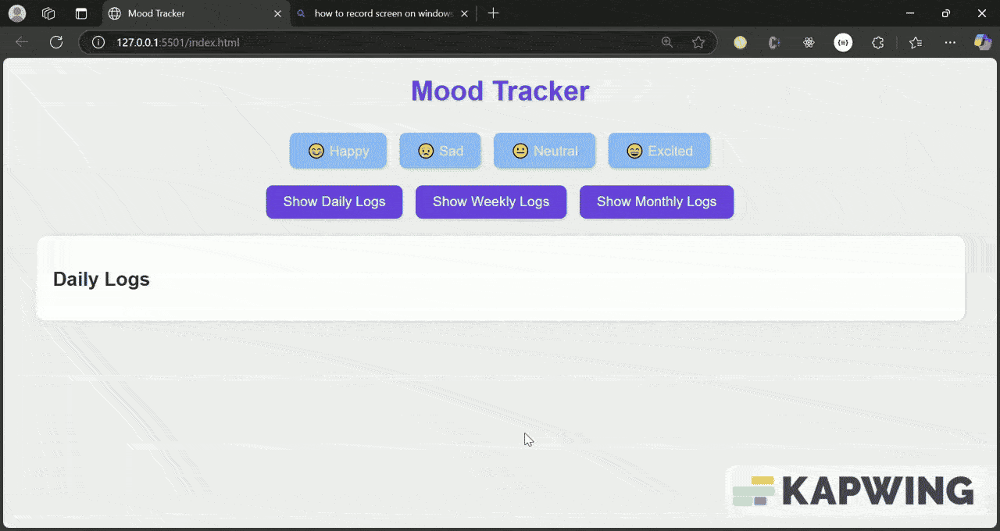

# Mood Tracker

A simple, responsive web application to log and track your daily moods over time. Users can select a mood emoji, store it locally, and visualize their emotional trends in daily, weekly, or monthly views.

## Features

- **Mood Logging:** Choose from four mood options (😊 Happy, 😢 Sad, 😐 Neutral, 😄 Excited) with a single click.
- **Persistent Storage:** Moods are saved in the browser's LocalStorage, ensuring data persists across sessions.
- **Timeline Views:** Visualize mood logs in three views:
  - **Daily:** Grouped by date with timestamps.
  - **Weekly:** Displays moods from the last 7 days.
  - **Monthly:** Shows moods from the last 30 days.
- **Responsive Design:** Fully functional and visually appealing on both mobile and desktop devices.
- **Interactive UI:** Hover effects, smooth transitions, and a clean layout enhance the user experience.

## Tech Stack

- **HTML5:** Structure and semantic markup.
- **CSS3:** Styling with Flexbox, Grid, and media queries for responsiveness.
- **JavaScript (Vanilla):** Core logic for mood logging, LocalStorage management, and dynamic timeline rendering.
- **LocalStorage:** Browser-based storage for persisting mood data.
- **No External Dependencies:** Lightweight and self-contained.

## Screen Recoding (GIF)



**Deployed Link:** [https://dailymoodtracker0.netlify.app/](#)

## Usage

1. Open the app in your browser.
2. Click a mood button (e.g., 😊 Happy) to log your current mood.
3. Use the filter buttons ("Show Daily Logs," "Show Weekly Logs," "Show Monthly Logs") to switch views.
4. View your mood history in the timeline below.

## Project Structure

```
mood-tracker/
├── index.html       # Main HTML file with structure, styles, and logic
├── screenshots/     # Folder for storing screenshots (create this)
│   └── mood-tracker.png  # Example screenshot (add your own)
└── README.md        # Project documentation (this file)
```

## Contributing

Feel free to fork this repository and submit pull requests with improvements! Suggestions for additional features (e.g., a calendar view, mood statistics) are welcome.
